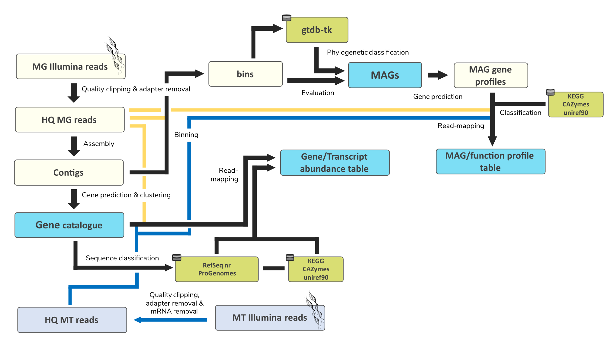

# MetaSeq-Toolkit
## UNDER CONSTRUCTION
Pipeline currently untested - to be considered not stable/working
## MOST OF THE STUFF HERE ARE PLACEHOLDERS

## Scope
1.	Quality trimming and adapter removal of Illumina reads
2.	Assembly of Metagenomes using metaSPAdes in HPC environments
3.	Quality filtering of assembled contigs
4.	Generation of a non-redundant gene catalogue
5.	Classification of genes
a.	Taxonomy (Kaiju): RefSeq, Progenomes
b.	Function: KEGG (GHOSTKOLA), CAZYmes
6.	MAG binning (Metabat2)
7.	rRNA depletion of transcriptomes (sortmerna)
8.	Read mapping (bowtie2)
The “MetaGenome_assembly.sh”-wrapper handles Quality trimming and gene-catalogue generation. Since the assembly is a very computationally intensive process, this is done using the [HPC environment of CARL](https://uol.de/fk5/wr/hochleistungsrechnen/hpc-facilities) and requires transfer of files. You can find information on how to apply of a HPC account [here](https://uol.de/fk5/wr/hochleistungsrechnen/faq-frequently-asked-questions).
MetaGenome_assembly.sh is modular – meaning, you can to run modules in sequence or modify parameters in further analysis.
